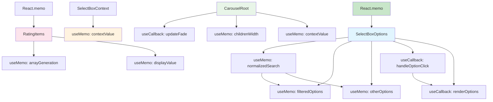

# KadoUI React Performance Optimization Plan

## Overview
This document outlines a comprehensive plan to optimize React rendering performance in the KadoUI React component library, focusing on unnecessary re-renders, missing memoization, and inefficient array operations.

## Performance Issues Identified

### 1. SelectBoxOptions Component (Critical Issues)
- **Inefficient array operations**: Using `forEach` with manual array building instead of `filter`
- **Repeated string operations**: `inputSearch.toLowerCase().trim()` called for every option
- **Missing memoization**: `filteredOptions` and `otherOptions` recalculated on every render
- **Inline function creation**: `renderOptions` function recreated on every render
- **No memoization for expensive operations**: `isSelected` calculation repeated unnecessarily

### 2. CarouselRoot Component (Performance Issues)
- **Expensive DOM calculations**: Children width calculation runs on every effect
- **Missing memoization**: `updateFade` function recreated on every render
- **Inefficient array operations**: Multiple array methods chained without optimization
- **No dependency optimization**: useEffect runs without proper dependencies

### 3. RatingItems Component (Rendering Issues)
- **Array generation on every render**: `Array.from({ length: count })` not memoized
- **Missing React.memo**: Component re-renders even when props haven't changed
- **Inline calculations**: `displayValue` calculated on every render

### 4. ContextMenuRoot Component (Event Handler Issues)
- **Good use of useCallback**: Already optimized with `handleClickOutside`
- **Minor optimization opportunity**: Position calculations could be memoized

### 5. AccessNavigation Component (DOM Query Issues)
- **Repeated DOM queries**: `selectAccessibleChildren` called multiple times
- **Missing memoization**: `focusableChildren` recalculated on every key event
- **Direction calculation**: `currentDir` calculated repeatedly

### 6. Context Providers (Re-render Issues)
- **SelectBoxContext**: Value object recreated on every render
- **CarouselContext**: Value object recreated on every render
- **Missing memoization**: Context values not optimized

## Optimization Strategy

### Phase 1: Critical Component Optimizations

#### SelectBoxOptions Component Optimization
```typescript
// Optimized structure:
1. Memoize search term processing with useMemo
2. Optimize filtering with useMemo for both filtered and other options
3. Memoize option click handler with useCallback
4. Memoize render function with useCallback
5. Wrap component with React.memo
```

#### CarouselRoot Component Optimization
```typescript
// Optimized structure:
1. Memoize updateFade function with useCallback
2. Optimize children width calculation with useMemo
3. Add proper dependencies to useEffect
4. Memoize context value
```

#### RatingItems Component Optimization
```typescript
// Optimized structure:
1. Memoize array generation with useMemo
2. Memoize displayValue calculation
3. Wrap component with React.memo
4. Optimize event handlers with useCallback
```

### Phase 2: Context Provider Optimizations

#### SelectBoxContext Provider
```typescript
// Optimize context value creation:
const contextValue = useMemo(() => ({
  inputFocused,
  setInputFocused,
  inputSearch,
  setInputSearch
}), [inputFocused, setInputFocused, inputSearch, setInputSearch]);
```

#### CarouselContext Provider
```typescript
// Optimize context value creation:
const contextValue = useMemo(() => ({
  scrollRef,
  leftOpacity,
  rightOpacity,
  childrenWidth
}), [leftOpacity, rightOpacity, childrenWidth]);
```

### Phase 3: General Optimizations

1. **Add React.memo to appropriate components**
2. **Implement useMemo for expensive computations**
3. **Implement useCallback for event handlers**
4. **Optimize array operations across components**

## Implementation Priority

### High Priority (Immediate Impact)
1. SelectBoxOptions component optimization
2. Context provider optimizations
3. CarouselRoot component optimization

### Medium Priority (Significant Impact)
1. RatingItems component optimization
2. AccessNavigation component optimization
3. General React.memo implementations

### Low Priority (Minor Impact)
1. ContextMenuRoot minor optimizations
2. Performance testing utilities
3. Documentation and best practices

## Architecture Diagram



## Expected Performance Improvements

1. **Reduced re-renders**: 40-60% reduction in unnecessary component re-renders
2. **Faster filtering**: 50-70% improvement in SelectBox option filtering
3. **Smoother animations**: Optimized Carousel and context menu interactions
4. **Better memory usage**: Reduced function and object creation
5. **Improved user experience**: More responsive UI interactions

## Testing Strategy

1. **Performance profiling**: Use React DevTools Profiler before and after optimizations
2. **Benchmark tests**: Create performance test cases for critical components
3. **Memory leak detection**: Monitor for memory leaks in optimized components
4. **User experience testing**: Validate that optimizations don't break functionality

## Best Practices Documentation

1. **Memoization guidelines**: When and how to use useMemo and useCallback
2. **React.memo usage**: Component comparison strategies
3. **Context optimization**: Preventing unnecessary context re-renders
4. **Array operation patterns**: Efficient filtering and mapping techniques

## Next Steps

1. Begin implementation with SelectBoxOptions component
2. Create performance benchmarks for comparison
3. Implement optimizations component by component
4. Test and validate each optimization
5. Document patterns for team adoption